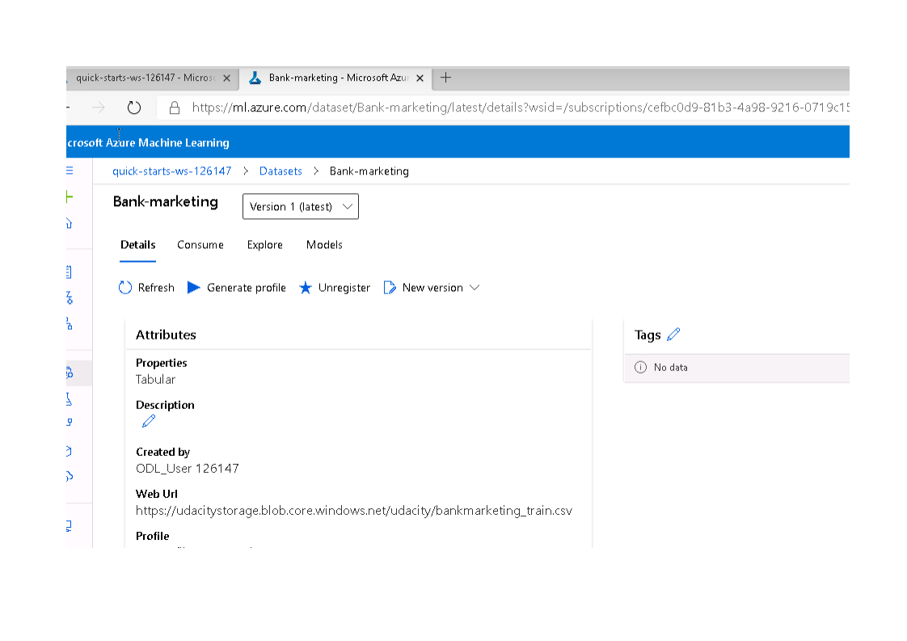

# Machine Learning Ops Principles

## Overview

This project is part of the Udacity Azure ML Nanodegree. The purpose of this project is to apply principles of DevOps to Machine Learning. This implies deploy a model and put it to production, consume its endpoints to interact with the model in Azure ML Studio, as well as create, publish and consume a pipeline to automate the entire process.

## Summary

In this project we use the <a href="https://archive.ics.uci.edu/ml/datasets/Bank+Marketing">UCI Bank Marketing dataset</a>, related with direct marketing campaigns of a Portuguese banking institution, and the target variable is the subscription (or not) of a term deposit. The data originated in the paper: S. Moro, P. Cortez and P. Rita. A Data-Driven Approach to Predict the Success of Bank Telemarketing. Decision Support Systems, Elsevier, 62:22-31, June 2014.

The entire project can be summarized in the following diagram

All icons come from <a href="https://www.flaticon.com/" title="Flaticon"> www.flaticon.com</a>, and were made by <a href="https://www.flaticon.com/authors/vitaly-gorbachev" title="Vitaly Gorbachev">Vitaly Gorbachev</a>, <a href="https://www.flaticon.com/authors/becris" title="Becris">Becris</a>, <a href="https://www.flaticon.com/authors/mynamepong" title="mynamepong">mynamepong</a>,<a href="https://www.flaticon.com/authors/smartline" title="Smartline">Smartline</a>, <a href="https://www.flaticon.com/authors/phatplus" title="phatplus">phatplus</a>, <a href="https://www.flaticon.com/authors/eucalyp" title="Eucalyp">Eucalyp</a>, <a href="https://www.flaticon.com/authors/eucalyp" title="Eucalyp">Eucalyp</a>, and <a href="https://www.flaticon.com/free-icon/pipeline_1418036?related_item_id=1418124&term=pipeline%20industry" title="phatplus">phatplus</a> in that order.

## Authentication

Since I used Udacity´s accout to log into Azure, I did not have the required authorization to create a Service Principal and allow him/her access to the workspace, therefore I skipped this step.

## Create and deploy an AutoML model

### Register a dataset

The required dataset was already registered in the provided workspace

### AutoML experiment

The next step is to start an AutoML experiment and adjust the settings. It requires to select the dataset just registered, select an existing compute cluster or create a new one (in this case, I created a new compute cluster with a virtual machine of size "Standard_DS12_V2" and one minimum node). Select "classification" as the task to be performed, select "y" as the target variable, select "AUC weighted" as the primary metric and k-fold cross validation, uncheck the box for neural networks, check the box for "Explain best model", set the exit criterion to 1 hour and the maximum concurrent iterations to 5. Then submit the experiment and wait for completion.

Once the experiment is completed, we can check the best model.

Finally, we can have a look at the model explanation. The global importance section shows a barchart of the relative importance of each feature in the model. The summary importance section shows three type of plots: Box, Swarm and Violin. Clicking on a point in swarm plot we can see each feature contribution for that particular point to its predicted label.

### Deploy best model

Once the autoML run is completed, we deploy the best model by clicking on the "deploy" arrow. We need to assign a name, optionally add a description, assign the compute type, which in our case is Azure Container Instance and we switch the toggle key to allow authentication. If successful, we will see a green message on top saying that the deployment has started. If we go to endpoints in the menu we can see the endpoint in the list, clicking on it we see that it was deployed and its healthy, we can see the swagger.json link and the URL. Entering the "consume" tab we see the endpoint and the keys. Below are screen captures of all of those steps. We will need to come back to these screens to copy the endpoint's name, its URL, the key primary key and the link to the swagger.json for future work.

### Enable application insights and logs

If we look at the endpoint generated above, application insights is not enabled. To do that programatically, we use the log.py file provided. Since the program calls for a config.json file, we need to make sure we have that file in the same folder, or download it otherwise. Then we need to put the name of the deployed service where indicated and finally we add a line of code after instanciating  the Webservice and before calling the logs:``service.update(enable_app_insights=True)`` .  After that, we run the program in git-bash, and if we go back to Azure, we can see that now it is enabled

And also, we can see the logs in git-bash showed after running log.py

### Document endpoint with Swagger

To work with Swagger, we need to download the swagger.json file and put it into the same folder as the swagger.sh and serve.py files. The file can be found in the details tab of the endpoint created before. We click on the link and download the file that will open in a new window. We then open git-bash and run ``bash swagger.sh`` (I had to change the original file to a 9000 port). If we then go to http://localhost:9000 we see the default swagger information

We then run ``python serve.py`` , go back to this swagger page and replace petstore.swagger.io/v2/ with localhost:8000 and we get the model´s information:

(Note: since I had problems running swagger the first time, I did it again the next day, on the notebook model). Below are some screenshots of the swagger documentation.

### Consume endpoint

Next we can try the endpoint running a script, using the provided endpoint.py. First we need to go back to the Azure window where we have the endpoint, go to the "consume" tab.

We copy the URL and the primary key and past them into the appropriate places in the python file. Then, on git-bash, we run ``python endpoints.py`` and see the two predictions returned.

### Benchmark endpoint

The previous step generated a data.json file in the same folder. With this file and using Apache Benchmark we can explore the endpoint performance using one of the provided files, benchmark.sh. We need to replace the primary key and the URL first, and then run on git-bash ``bash benchmark.sh``.  This will result in the output shown below, where we find information about the number of requests completed as well as the number of failed ones. We also see the mean time of response and the number of requests per second. We can also see some statistics on response time.

## Publish a pipeline

In this section we run a notebook created to load and register a dataset, and create a pipeline to train a model using AutoML. After that, we retrieve, inspect and register the best model. Finally, we publish the pipeline to the workspace. Then we test the pipeline endpoint using the same notebook.

Pipeline running in ML Studio

Using RunDetails Widget we can monitor the pipeline

The pipeline shows the Bankmarketing dataset with the AutoML module

The “Published Pipeline overview”, showing a REST endpoint and a status of ACTIV

The pipeline section of Azure ML Studio, showing the endpoint active

The pipeline run from the endpoint

## Link to video

[youtube video](https://youtu.be/FXyBRcZ3G6s) (At the moment is ocult, it can only be viewed with the link. Once I pass this project, I´ll make it public and remove this line).

## Future work

The first line of improvements to this project was already mentioned in the first one: deal with class inbalance and remove duration from the features list, to improve the model itself.

Regarding deployments, I should be able to solve the optional deployments, specially batch scoring and docker.
