# Other Deployments
## Overview
I attempted the three other deployments suggested in the rubrica unsuccessfully. I am presenting this document, the notebook and some screenshots hopping you can help me solve the issues I faced with each of them.

I run an AutoML experiment with ONNX support, I saved and registered both the best model and the best onnx model. I downloaded the best model and extracted it to obtain the scoring script and the conda environment. I did this both in the provided virtual machine and in my own computer using the lab credentials. I faced the same problems in both cases. All the information is in the optional folder.
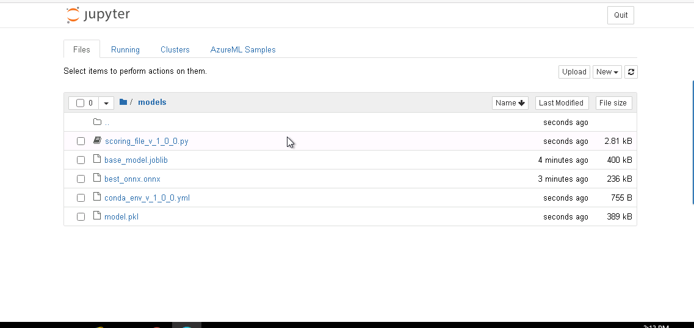
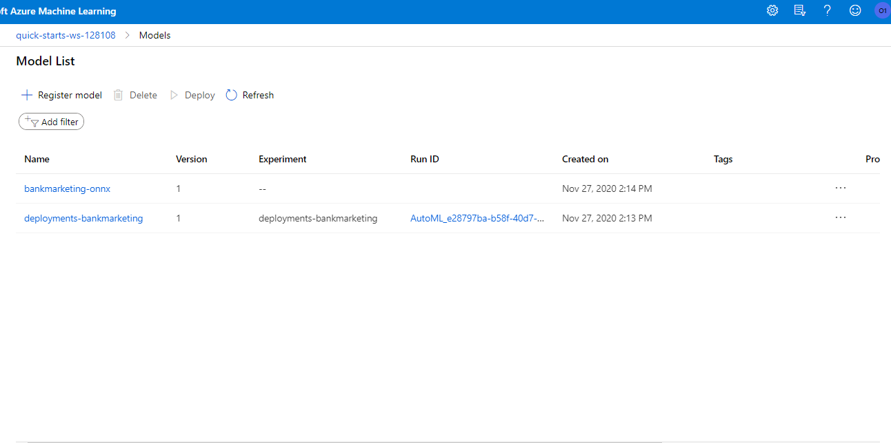

## Docker
Following the tutorial indicated in the rubrica, I was able to create and pull a docker image using the scoring script and conda environment downloaded before. However, after running ``docker images`` in git-bash, no image was found.
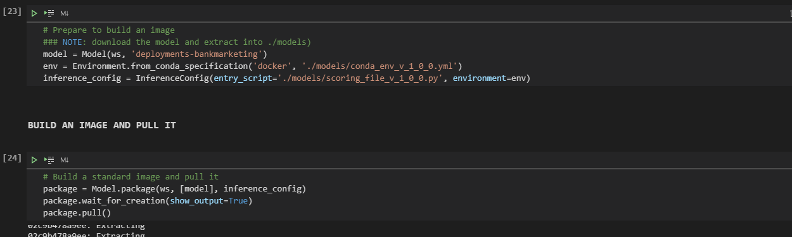

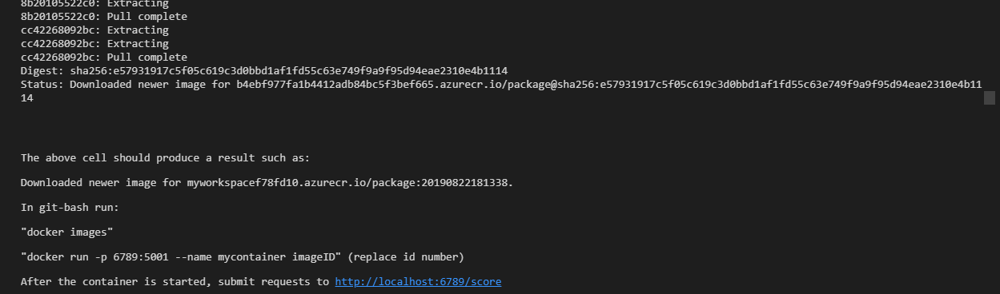

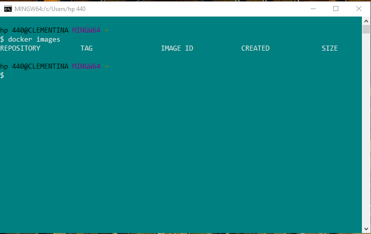

I then try to download the Dockerfile to create a local image and got stuck at this point and the build did not continue. All files downloaded are in the [Docker](./optional/docker) folder
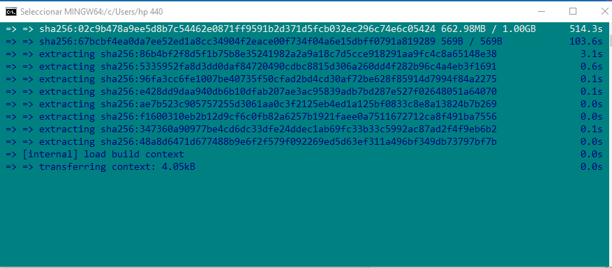

## Batch scoring
I used the best model scoring file and its conda environment to create the batch scoring pipeline
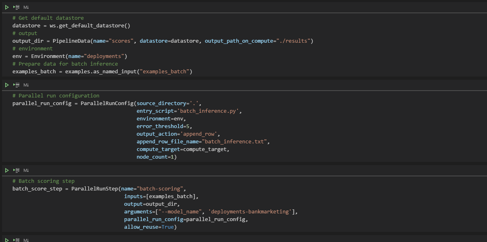

I was able to run the entire process and until it showed as "finishing" and then it imediately changed to "failed" 
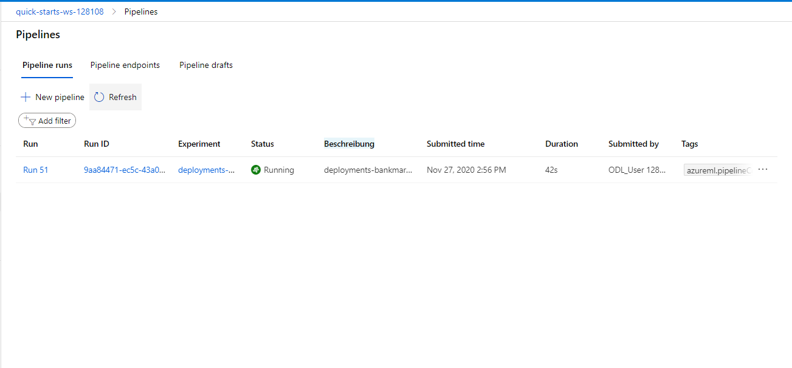
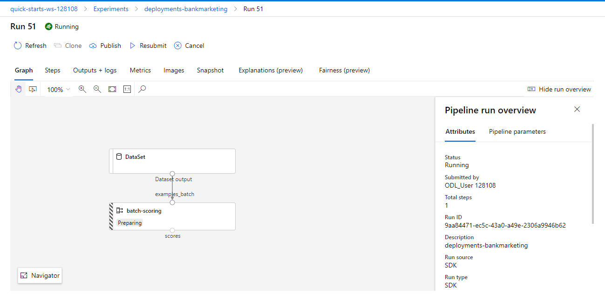
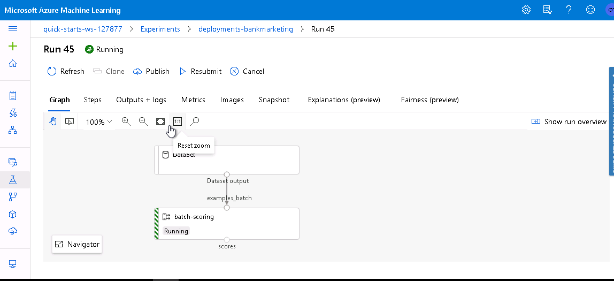
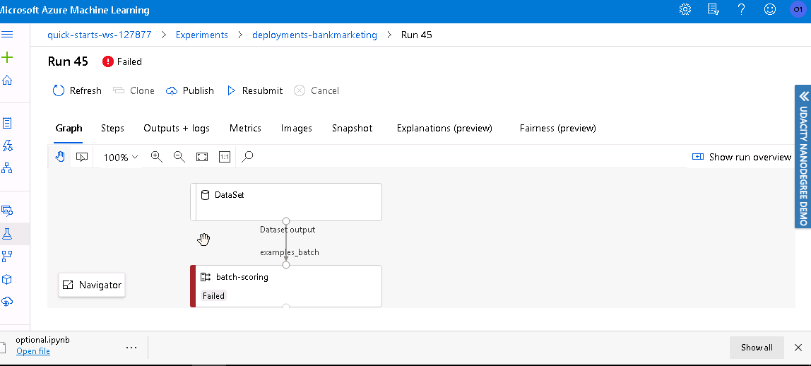

This is where the notebook shows the failure
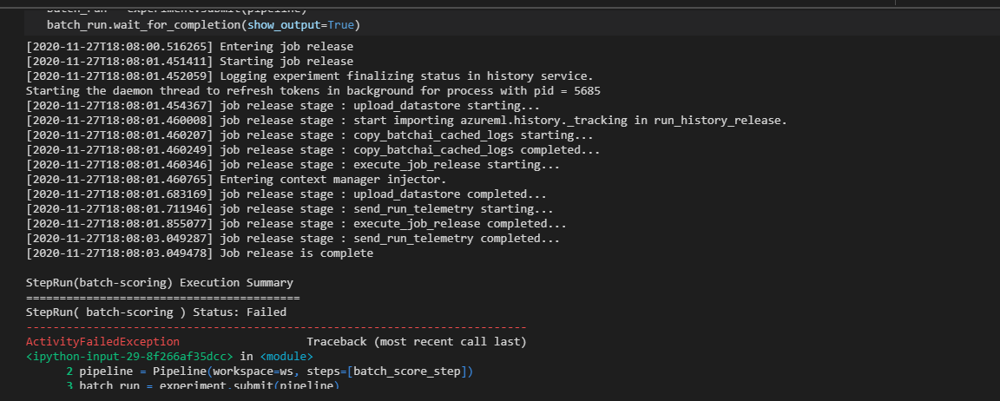

I was, however, able to publish and get an endpoint for the pipeline
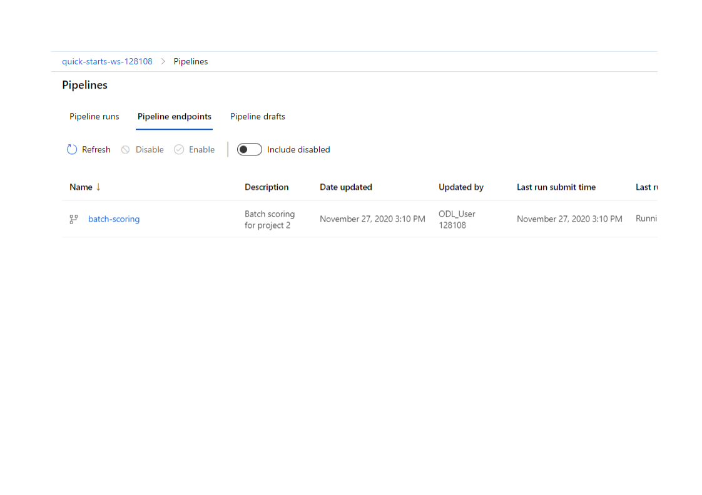
## ONNX
I tried to use the registered onnx model following the [onnx tutorial](https://docs.microsoft.com/en-us/azure/machine-learning/concept-onnx) in the rubrica, but it has only numeric features, my model has 
several non-numeric features, so it didn´t work. I looked extensively on internet models that did not have numeric features and I couldn´t find any. In most cases there were images turned into tensors or the iris dataset. I found a [tutorial](https://docs.microsoft.com/en-us/azure/machine-learning/how-to-deploy-advanced-entry-script) which has a part for PowerBI consumption that has non-numeric features, I tried it and I couldn´t make it work either. I am not sure what else to do here.

