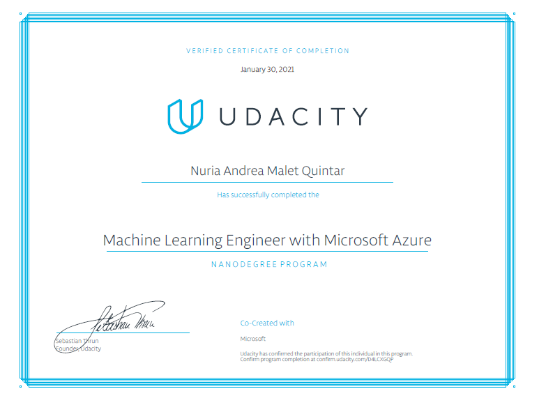

# ML Engineer with Azure

This repository has all the projects in Udacity's nanodegree

## Project 1

### Using Azure ML Platform

This project creates and optimizes a machine learning pipeline. First, I fit a logistic regression and optimize its parameters using HyperDrive. Later, I run an AutoML experiment on the same dataset to compare the results. The project uses the [Bank Marketing dataset](https://automlsamplenotebookdata.blob.core.windows.net/automl-sample-notebook-data/bankmarketing_train.csv) available in Azure platform.

## Project 2

### Machine Learning Operations

This project uses the same dataset than the previous one. In the first part, I use the Azure Machine Learning Studio interface to train and deploy a model. Then I use different tools to document, benchmark and monitor the endpoint. Finally, I test the endpoint using a python script. In the second part, I create and publish and consume a pipeline to train and deploy the same model.

## Capstone Project

### California Housing Prices

This project builds and deploys a model to estimate median house values for California districts. First I run two separate experiments: one is a Stochastic Gradient Descent Regression with its hyperparameters tuned via HyperDrive; the second is an AutoML experiment. In both cases the target variable is the median house value and the primary metrics is $r^2$. The best model is then deployed as a webservice. For this project, I use the California Housing dataset available in Scikit-Learn, which was obtained from [http://lib.stat.cmu.edu/datasets/](http://lib.stat.cmu.edu/datasets/). The dataset was submitted by Kelley Pace ([kpace@unix1.sncc.lsu.edu](mailto:kpace@unix1.sncc.lsu.edu)) on 9/Nov/99 and first appeared in Pace and Barry (1997), "Sparse Spatial Autoregressions", Statistics and Probability Letters.

## Certificate

