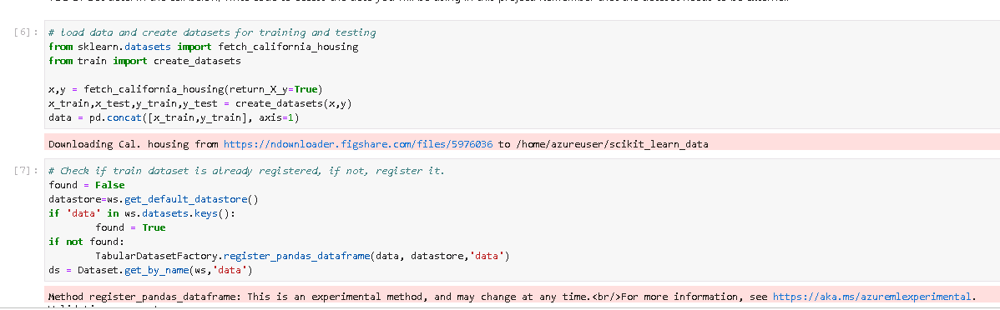
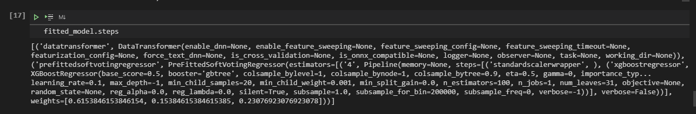

# Housing Prices in California

This project builds and deploys a model to estimate median house values for California districts. First we run two separate experiments: one is a Stochastic Gradient Descent Regression with its hyperparameters tuned via hyperdrive; the second is an AutoML experiment. In both cases the target variable is the median house value and the primary metrics is $r^2$. The best model is then deployed as a webservice.

## Dataset

### Overview

For this project, I use the California Housing dataset available in Scikit-Learn, which was obtained from http://lib.stat.cmu.edu/datasets/. The dataset was submitted by Kelley Pace (kpace@unix1.sncc.lsu.edu) on 9/Nov/99 and first appeared in Pace and Barry (1997), "Sparse Spatial Autoregressions", Statistics and Probability Letters.

According to the documentation, this dataset was derived from the 1990 U.S. census, using one row per census block group (which is the smallest geographical unit for which the U.S. Census Bureau publishes sample data).

The dataset contains 20,640 observations on housing prices with 8 predictive atributes and the median house value for California districts, wich is the target value to be predicted. The features and target are:

* MedInc: median income in block
* HouseAge: median house age in block
* AveRooms: average number of rooms
* AveBedrms: average number of bedrooms
* Population: block population
* AveOccup: average house occupancy
* Latitude: house block latitude
* Longitude: house block longitude
* MedHouseVal: median house value

### Task

As mentioned before, the project performs regressions on all the features to predict the value of the target variable, the median house value of the houses in the Census Block.

### Access

The dataset is accessed via the function ````sklearn.datasets.fetch_california_housing(return_X_y = True)````. This function returns a tuple with features as first element and target as the second. Starting from scikit-learn version 0.23, there is an optional parameter ```as_frame = True``` that returns two pandas dataframes; however, this was not available in azureml notebooks environment at the time of the project.

Once downloaded the data has to be converted to pandas and preprocess. The dataset is clean, so the only preprocessing needed is splitting the sets in train and test. For the hyperdrive experiment no further work is necessary. For the AutoML experiment, the target variable needs to be added again to the features, and the dataset needs to be converted to a TabularDataset and register in the workspace. To do that, there is an experimental method in the ```TabularDatasetFactory``` class that, at the time of the project, was working: ```TabularDatasetFactory.register_pandas_dataframe(data, datastore,'data')```. Should this method fail in the future, the notebook contains alternative code to register the dataset.



## Automated ML

### Setup

At the time of the project there was a difference in SDK versions between the notebook environment and the AutoML. The model was able to train, but it could not predict new values for the target variable on the test dataset. To solve that issue, the following needed to be run at the beginning:

```!pip install --upgrade --upgrade-strategy eager azureml-sdk[automl,widgets,notebooks]```

### Settings and Configuration

- Settings

In the AutoML settings for the project, we established a maximum time of one hour (to be able to finish the entire project within the four hours of the lab), we set the maximum number of concurrent iterations to five (because it has to be set, at most, at the value of the maximum nodes of the compute cluster created), and we set the primary metric to be $r^2$, to match the primary metric logged by the hyperdrive experiment.

- Configuration

In the configuration part we set parameters for AutoML training. In this project we included a reference to the compute target created for the training, we named the task to be performed (regression) as well as the dataset and the target (label) variable, we enable early stopping to save resources, we requested for AutoML to do automatic featurization, we established a validation size of 20% instead of number of cross-validations, and we requested to run explainability on the best model. We left out the metrics goal, as it defaults to maximize, we did not include deep learning models, and we did not black-listed any algorithms (except for deep learning).

### Results

*TODO*: What are the results you got with your automated ML model? What were the parameters of the model? How could you have improved it?

*TODO* Remeber to provide screenshots of the `RunDetails` widget as well as a screenshot of the best model trained with it's parameters.

add model explanation



## Hyperparameter Tuning

*TODO*: What kind of model did you choose for this experiment and why? Give an overview of the types of parameters and their ranges used for the hyperparameter search

### Results

*TODO*: What are the results you got with your model? What were the parameters of the model? How could you have improved it?

*TODO* Remeber to provide screenshots of the `RunDetails` widget as well as a screenshot of the best model trained with it's parameters.

## Model Deployment

*TODO*: Give an overview of the deployed model and instructions on how to query the endpoint with a sample input.

add swagger

add app-insights

show service.log()

## Screen Recording

*TODO* Provide a link to a screen recording of the project in action. Remember that the screencast should demonstrate:

- A working model
- Demo of the deployed  model
- Demo of a sample request sent to the endpoint and its response
