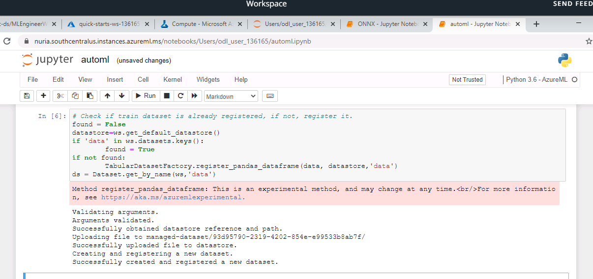
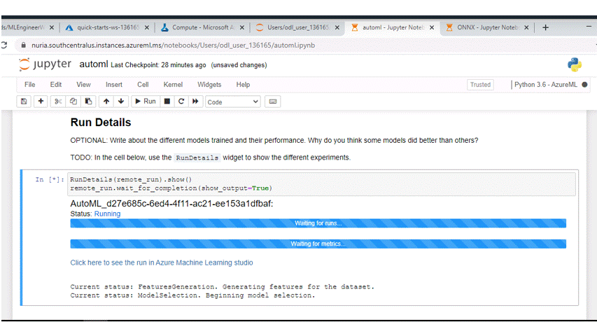
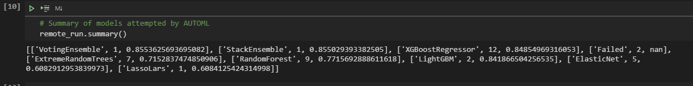
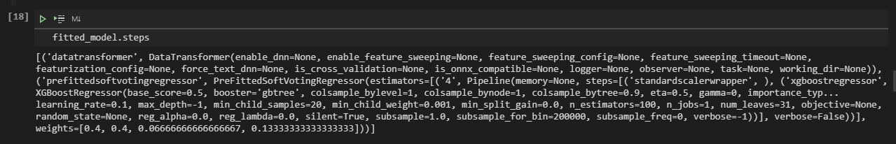
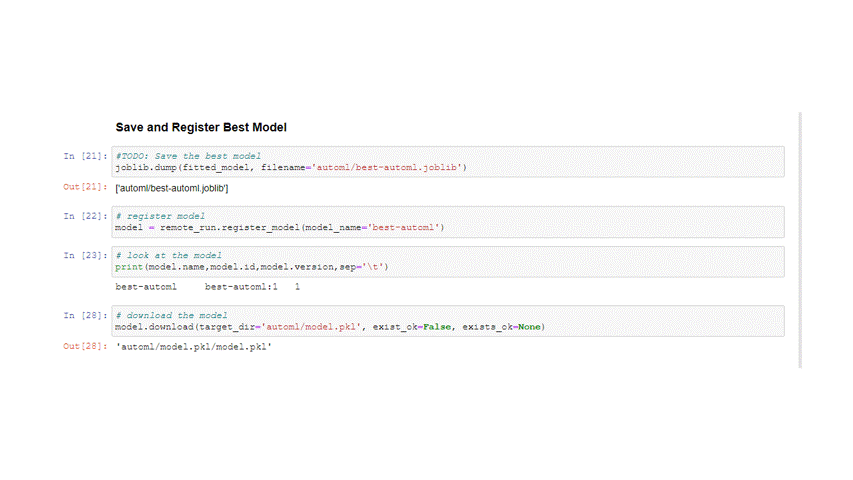
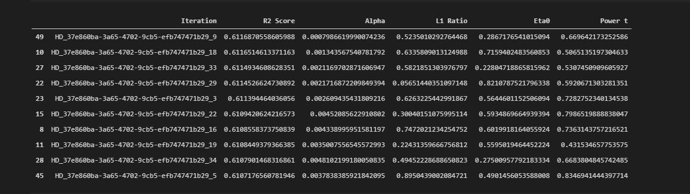
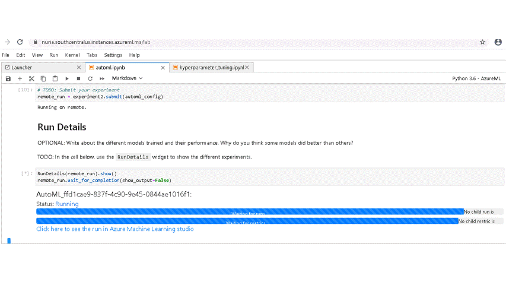
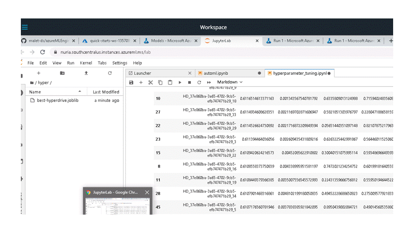

# Housing Prices in California

This project builds and deploys a model to estimate median house values for California districts. First we run two separate experiments: one is a Stochastic Gradient Descent Regression with its hyperparameters tuned via hyperdrive; the second is an AutoML experiment. In both cases the target variable is the median house value and the primary metrics is $r^2$. The best model is then deployed as a webservice.

## Dataset

### Overview

For this project, I use the California Housing dataset available in Scikit-Learn, which was obtained from http://lib.stat.cmu.edu/datasets/. The dataset was submitted by Kelley Pace (kpace@unix1.sncc.lsu.edu) on 9/Nov/99 and first appeared in Pace and Barry (1997), "Sparse Spatial Autoregressions", Statistics and Probability Letters.

According to the documentation, this dataset was derived from the 1990 U.S. census, using one row per census block group (which is the smallest geographical unit for which the U.S. Census Bureau publishes sample data).

The dataset contains 20,640 observations on housing prices with 8 predictive atributes and the median house value for California districts, wich is the target value to be predicted. The features and target are:

* MedInc: median income in block
* HouseAge: median house age in block
* AveRooms: average number of rooms
* AveBedrms: average number of bedrooms
* Population: block population
* AveOccup: average house occupancy
* Latitude: house block latitude
* Longitude: house block longitude
* MedHouseVal: median house value

More information of the dataset can be found in this [notebook](sklearn_california_dataset.ipynb)

### Task

As mentioned before, the project performs regressions on all the features to predict the value of the target variable, the median house value of the houses in the Census Block.

### Access

The dataset is accessed via the function ````sklearn.datasets.fetch_california_housing(return_X_y = True)````. This function returns a tuple with features as first element and target as the second. Starting from scikit-learn version 0.23, there is an optional parameter ```as_frame = True``` that returns two pandas dataframes; however, this was not available in azureml notebooks environment at the time of the project.

Once downloaded the data has to be converted to pandas and preprocess. The dataset is clean, so the only preprocessing needed is splitting the sets in train and test. For the hyperdrive experiment no further work is necessary. For the AutoML experiment, the target variable needs to be added again to the features, and the dataset needs to be converted to a TabularDataset and register in the workspace. To do that, there is an experimental method in the ```TabularDatasetFactory``` class that, at the time of the project, was working: ```TabularDatasetFactory.register_pandas_dataframe(data, datastore,'data')```. Should this method fail in the future, the notebook contains alternative code to register the dataset.



## Automated ML

### Setup

At the time of the project there was a difference in SDK versions between the notebook environment and the AutoML. The model was able to train, but it could not predict new values for the target variable on the test dataset. To solve that issue, the following needed to be run at the beginning:

```!pip install --upgrade --upgrade-strategy eager azureml-sdk[automl,widgets,notebooks]```

### Settings and Configuration

- Settings

In the AutoML settings for the project, we established a maximum time of one hour (to be able to finish the entire project within the four hours of the lab), we set the maximum number of concurrent iterations to five (because it has to be set, at most, at the value of the maximum nodes of the compute cluster created), and we set the primary metric to be $r^2$, to match the primary metric logged by the hyperdrive experiment.

- Configuration

In the configuration part we set parameters for AutoML training. In this project we included a reference to the compute target created for the training, we named the task to be performed (regression) as well as the dataset and the target (label) variable, we enable early stopping to save time and resources in case the training stops improving, we requested for AutoML to do automatic featurization, we established a validation size of 20% instead of number of cross-validations to match the hyperdrive experiment, and we requested to run explainability on the best model. We left out the metrics goal, as it defaults to maximize, we did not include deep learning models, and we did not black-listed any algorithms (except for deep learning).

For more information see [Azure documentation](https://docs.microsoft.com/en-us/python/api/azureml-train-automl-client/azureml.train.automl.automlconfig.automlconfig?view=azure-ml-py)

### Results

During the training process we can follow its advances using ```RunDetails``` widget



Once the training ends, we can check the best model as well as all the metrics for all the child runs. The algorithms attempted by AutoML with their primary metrics are:



In cell #14 of the [notebook](automl.ipynb) we collected all metrics from all runs in the experiment and printed the first five. Also, in cell #15 we printed all metrics from the best model. The most relevant for our purpose is $r^2=0.85536$. This was achieved by the iteration number 38, with the ***voting ensamble*** algorithm and the following structure (see cell #19 for complete set of parameters):



To summarize, the ensamble uses three XGBoost Regressors, scaled with StandardScalerWrapper and different hyperparameters; and a LightGBM Regressor, scaled with MaxAbsScaler.

As a final step, the best model was saved to a folder named automl as joblib and as pkl. Then it was registered to the workspace.



## Hyperparameter Tuning

In order to decide which model to use for the hyperparameter tuning section, I fitted several models in the [notebook](sklearn_california_dataset.ipynb) mentioned before. From those models I concluded that the best ones were a vanila OLS and, slightly better, a Stochastic Gradient Descent Regressor. This last one was the chosen one for this project. 

Among the hyperparameters that I did not change were the loss function, left as the default `squared_loss` that recover a standard OLS; the maximum number of iterations, which I set very high but with early stopping enabled to prevent a failure to converge; the learning rate schedule, left as the default `invscaling`; and the penalty, which I chose to be`elasticnet`. The parameters tuned were:

* **alpha**: Multiplier of the regularization term. The higher the value, the stronger the regularization. I used a uniform distribution in the range (0.0001, 0.01) to cover both the documentation default value and the best result I got in my preparing work.
* **l1_ratio**: The Elastic Net mixing parameter. ``l1_ratio=0`` corresponds to L2 penalty, `l1_ratio=1` to L1. I used a uniform distribution in the range (0, 1) to cover all posibilities.
* **eta0**: The initial learning rate. I used a uniform distribution in the range (0.1, 0.9) based on my previous tests.
* **power_t**: The exponent for inverse scaling learning rate. I used a unifrom distribution in the range (0.01, 0.99) also as the result of my previous tests.

For more information, see [scikit learn documentation](https://scikit-learn.org/stable/modules/generated/sklearn.linear_model.SGDRegressor.htm).

### Results

The best hyperdrive estimation was achieved in the iteration number 9, with $r^2=0.611687$ and hyperparameters:

* Alpha = 0.0007986619990074236
* L1 Ratio = 0.5235010292764468
* Eta0 = 0.2867176541015094
* Power_t = 0.669642173252586

The table below shows the runID, $r^2$ , and hyperparameter values for the top ten models in the experiment.



As with the AutoML experiment, we can follow the run using RunDetails or in Machine Learining Studio as shown below.



Finally I saved and registered the model with the workspace.



## Model Deployment

*TODO*: Give an overview of the deployed model and instructions on how to query the endpoint with a sample input.

add swagger

add app-insights

show service.log()

## Screen Recording

*TODO* Provide a link to a screen recording of the project in action. Remember that the screencast should demonstrate:

- A working model
- Demo of the deployed  model
- Demo of a sample request sent to the endpoint and its response
