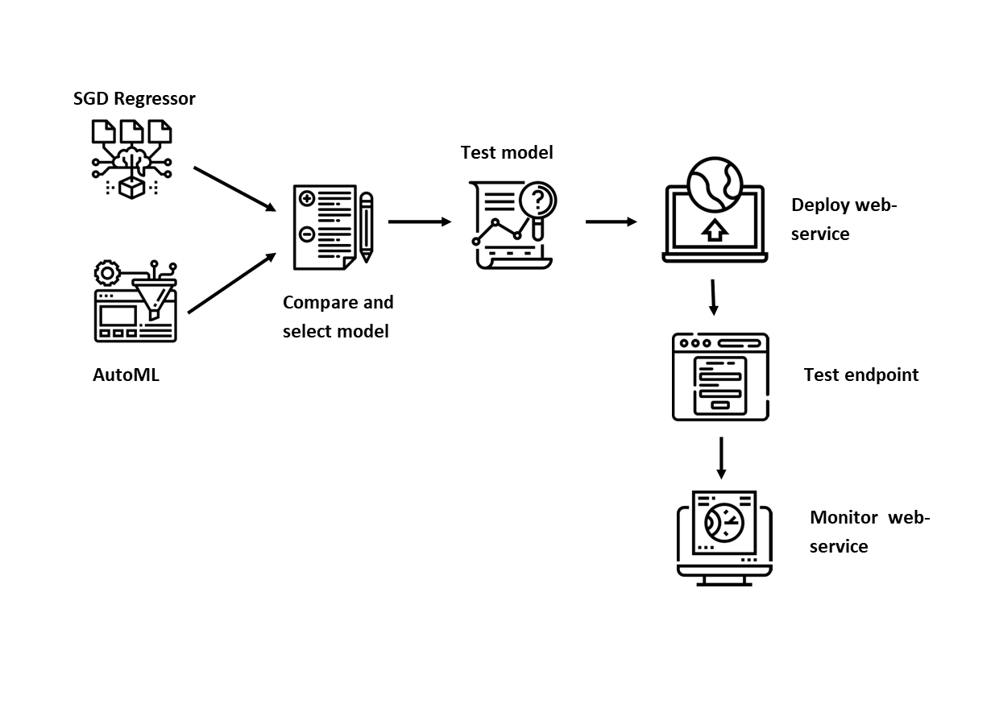
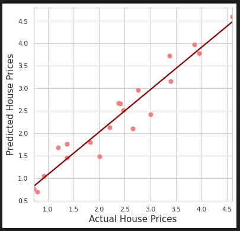
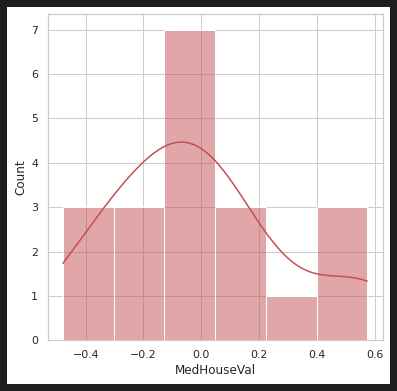
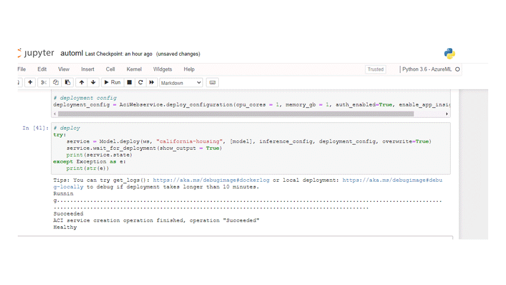
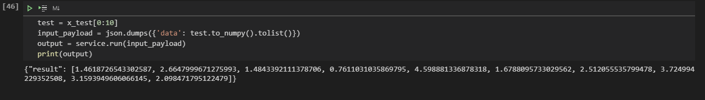
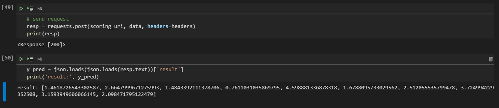
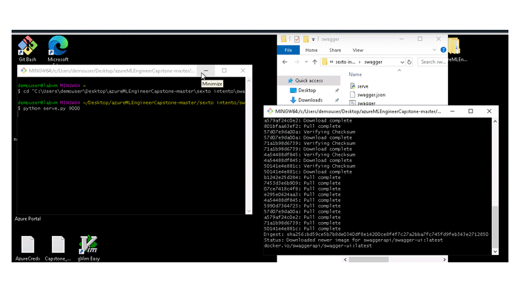
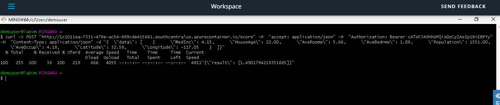
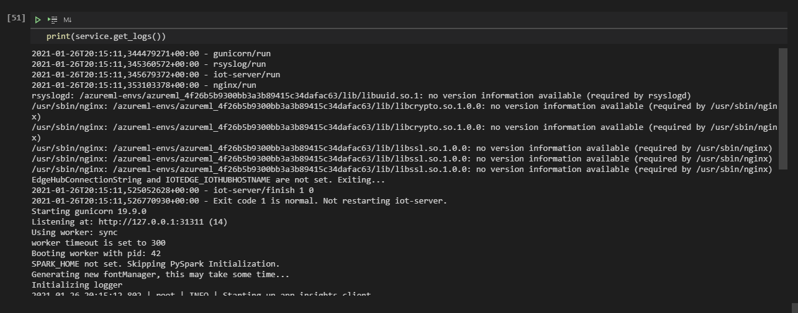

# Housing Prices in California

This project builds and deploys a model to estimate median house values for California districts. First I run two separate experiments: one is a Stochastic Gradient Descent Regression with its hyperparameters tuned via hyperdrive; the second is an AutoML experiment. In both cases the target variable is the median house value and the primary metrics is $r^2$. The best model is then deployed as a webservice.

All icons come from <a href="https://www.flaticon.com/" title="Flaticon"> www.flaticon.com</a>, and were made by Becris, Flat Icons, xnimrodx, dDara, mynamepong, Freepik, and Eucalyp in that order.

## Dataset

### Overview

For this project, I use the California Housing dataset available in Scikit-Learn, which was obtained from http://lib.stat.cmu.edu/datasets/. The dataset was submitted by Kelley Pace (kpace@unix1.sncc.lsu.edu) on 9/Nov/99 and first appeared in Pace and Barry (1997), "Sparse Spatial Autoregressions", Statistics and Probability Letters.

According to the documentation, this dataset was derived from the 1990 U.S. census, using one row per census block group (which is the smallest geographical unit for which the U.S. Census Bureau publishes sample data).

The dataset contains 20,640 observations on housing prices with 8 predictive atributes and the median house value for California districts, wich is the target value to be predicted. The features and target are:

* MedInc: median income in block
* HouseAge: median house age in block
* AveRooms: average number of rooms
* AveBedrms: average number of bedrooms
* Population: block population
* AveOccup: average house occupancy
* Latitude: house block latitude
* Longitude: house block longitude
* MedHouseVal: median house value

More information of the dataset can be found in this [notebook](sklearn_california_dataset.ipynb)

### Task

As mentioned before, I perform regressions on all the features to predict the value of the target variable, the median house value of the houses in the Census Block.

### Access

The dataset is accessed via the function ````sklearn.datasets.fetch_california_housing(return_X_y = True)````. This function returns a tuple with features as first element and target as the second. Starting from scikit-learn version 0.23, there is an optional parameter ```as_frame = True``` that returns two pandas dataframes; however, this was not available in azureml notebooks environment at the time of the project.

Once downloaded the data has to be converted to pandas and preprocess. The dataset is clean, so the only preprocessing needed is splitting the sets in train and test. For the hyperdrive experiment no further work is necessary. For the AutoML experiment, the target variable needs to be added again to the features, and the dataset needs to be converted to a TabularDataset and register in the workspace. To do that, there is an experimental method in the ```TabularDatasetFactory``` class that, at the time of the project, was working: ```TabularDatasetFactory.register_pandas_dataframe(data, datastore,'data')```. Should this method fail in the future, the notebook contains alternative code to register the dataset.


## Automated ML

### Setup

At the time of the project there was a difference in SDK versions between the notebook environment and the AutoML. The model was able to train, but it could not predict new values for the target variable on the test dataset. To solve that issue, the following needed to be run at the beginning:

```!pip install --upgrade --upgrade-strategy eager azureml-sdk[automl,widgets,notebooks]```

### Settings and Configuration

- Settings

In the AutoML settings for the project, I established a maximum time of one hour (to be able to finish the entire project within the four hours of the lab), I set the maximum number of concurrent iterations to five (because it has to be set, at most, at the value of the maximum nodes of the compute cluster created), and I set the primary metric to be $r^2$, to match the primary metric logged by the hyperdrive experiment.

- Configuration

In the configuration part I set parameters for AutoML training. I included a reference to the compute target created for training, I named the task to be performed (regression) as well as the dataset and the target (label) variable, I enable early stopping to save time and resources in case the training does not improve, I set it to do automatic featurization, I established a validation size of 20% instead of number of cross-validations to match the hyperdrive experiment, and I enabled explainability on the best model. I left out the metrics goal, as it defaults to maximize, I did not include deep learning models, and I did not black-listed any algorithms (except for deep learning).

For more information see [Azure documentation](https://docs.microsoft.com/en-us/python/api/azureml-train-automl-client/azureml.train.automl.automlconfig.automlconfig?view=azure-ml-py)

### Results

During the training process we can follow its advances using ```RunDetails``` widget


Once the training ends, we can check the best model as well as all the metrics for all the child runs. The algorithms attempted by AutoML with their primary metrics are:


In cell #14 of the [notebook](automl.ipynb) we collected all metrics from all runs in the experiment and printed the first five. Also, in cell #15 we printed all metrics from the best model. The most relevant for our purpose is $r^2=0.85536$. This was achieved by the iteration number 38, with the ***voting ensamble*** algorithm and the following structure (see cell #19 for complete set of parameters):


To summarize, the ensamble uses three XGBoost Regressors, scaled with StandardScalerWrapper and different hyperparameters; and a LightGBM Regressor, scaled with MaxAbsScaler.

As a final step, the best model was saved to a folder named automl as joblib and as pkl. Then it was registered to the workspace.


## Hyperparameter Tuning

In order to decide which model to use for the hyperparameter tuning section, I fitted several models in the [notebook](sklearn_california_dataset.ipynb) mentioned before. From those models I concluded that the best ones were a vanila OLS and, slightly better, a Stochastic Gradient Descent Regressor. This last one was the chosen one for this project.

Among the hyperparameters that I did not change were the loss function, left as the default `squared_loss` that recover a standard OLS; the maximum number of iterations, which I set very high but with early stopping enabled to prevent a failure to converge; the learning rate schedule, left as the default `invscaling`; and the penalty, which I chose to be`elasticnet`. The parameters tuned were:

* **alpha**: Multiplier of the regularization term. The higher the value, the stronger the regularization. I used a uniform distribution in the range (0.0001, 0.01) to cover both the documentation default value and the best result I got in my preparing work.
* **l1_ratio**: The Elastic Net mixing parameter. ``l1_ratio=0`` corresponds to L2 penalty, `l1_ratio=1` to L1. I used a uniform distribution in the range (0, 1) to cover all posibilities.
* **eta0**: The initial learning rate. I used a uniform distribution in the range (0.1, 0.9) based on my previous tests.
* **power_t**: The exponent for inverse scaling learning rate. I used a unifrom distribution in the range (0.01, 0.99) also as the result of my previous tests.

For more information, see [scikit learn documentation](https://scikit-learn.org/stable/modules/generated/sklearn.linear_model.SGDRegressor.htm).

For the early termination policy, I chose it to evaluate every iteration after the fifth one, and a slack factor of 0.2, which is the percentage distance allowed with respect to the best performing run, any child run falling outside that range will be terminated. This is used to save resources from being wasted on runs that are not performing well.

I chose a maximum of 50 runs to be able to complete the entire project in the time allowed in the lab. And I used four maximum concurrent runs because they need to be less than the number of nodes in the compute cluster.

### Results

The best hyperdrive estimation was achieved in the iteration number 9, with $r^2=0.611687$ and hyperparameters:

* Alpha = 0.0007986619990074236
* L1 Ratio = 0.5235010292764468
* Eta0 = 0.2867176541015094
* Power_t = 0.669642173252586

The table below shows the runID, $r^2$ , and hyperparameter values for the top ten models in the experiment.


As with the AutoML experiment, we can follow the run using RunDetails or in Machine Learining Studio as shown below.


Finally I saved and registered the model with the workspace.


This is not a very good model. The best $r^2$ reached was around 0.61, while the correlation between median house value and median income of the block is 0.69

## Model Selected

Based on $r^2$, I decided to deploy the voting ensamble model trained with AutoML. Before deploying the model I tested it on a sample of the data that I preserved for this. On these data, unseen by the model during training and validation, the model scored $r^2 = 0.9258$, which is an eve n better result that the one achieved at training. Then I plotted predicted median house values against actual ones, also for test data. The plot is shown below:



As we can see, the predicted values are reasonably close to a line with a 45° angle, which means the model is reasonably good. Next, we inspect the residuals in the graph below:



The residuals are not normally distributed and centered slightly off zero. This points to a sistematic error and implies that there might be some feature(s) missing from the model. Also, this could be the effect of a small sample.

Upon inspection of features importance, I noticed that median income in block, latitude and longitude were the most relevant ones. Looking at the results of the exploratory analysis we can see that median income has a correlation coefficient of 0.69 with median house value. Finally, looking at features distributions we can see that both latitude and longitude have a marked bimodal distribution, which I looked in the map and correspond to Los Angeles City and the San Francisco Area.

All of the above points to the conclusion that "neighborhood" might be the most relevant factor in predicting household values. The original dataset does not include many features on that, which leaves room for improvement. First, we could use latitude and longitude to generate spatial points and, using GIS programs, replace these two features by a cluster center representing a neighborhood and the difference of each block to the center. Also, we could enrich the dataset using other features at neighborhood level such as schools, colleges, libraries, transportation, commercial areas, entertainment availability, financial services, health services, turistic characteristics, crime data, and so forth.

## Model Deployment

To deploy the model, I first downloaded the scoring file and the conda specifications for the environment. I did that in cells #38 and #39 in the [notebook](automl.ipynb), and are saved int the automl folder. In the deployment configuration I enabled authentication - to protect the endpoint with an access key - and application insights - to monitor the endpoint on a graphical interface. Once the deployment succeded and showed as healthy, I checked in ML Studio to see its information. All of it is showed below.~~~~

Once deployed, we can test the service using a json payload and `service.run(input_payload)`This is shown in the next image.



To test the endpoint, I need to collect the URI and authentication keys. I also need to prepare the payload in the appropriate format and the headers. All that is done in cells #42, #43, #47, and #48. Then I sent the request to the endpoint and recieved the response and the resulting inferences, as shown below.



I used Swagger to make documenting the endpoint easier. For that I downloaded a `swagger.json` file using the link provided in ML Studio (shown above) or the method in cel #44, and saved into the swagger folder. Running ``swagger.sh`` and ``serve.py`` I gained access to the endpoint documentation where we can find examples of the response to GET method and a model of the payload expected by the POST method as well as the model. All of this is shown below.



Also, if we click on 'Authorize' and type 'BEARER  (primary key here)'  and replace the zeros in the example for actual values, swagger will provide a curl instruction to test (the URI needs to be replaced).



Finally, we can monitor the endpoint from the notebook, using ``service.get_logs()``



or using Application Insights


## Screen Recording

A vido showing the model and its deployment can be found [here](https://youtu.be/LcCZc8qXCyo).

## Concluding Remarks

In this project I conducted two experiments to develop a model to estimate house prices in California. The first one was a linear regression using stochastic gradient descent and the hyperdrive to tune its hyperparameters. The second was an autoML experiment that produced a best model which was a voting ensamble with three XGBoost models and one LightGBM. Then, I decided that the voting ensamble was the best model and tested it with data unseen by the model. Finally, I deployed it as a webservice.

In the testing section I mentioned possible improvements to the model. They can be summarized as: first, some feature engineering: converting latitude and longitude in 'neighborhoods' (clusters) with distance to the center. Second, enrich the dataset with neighborhood level data as mentioned above.

In terms of the deployment, it could be interesting to deploy it locally to docker.
